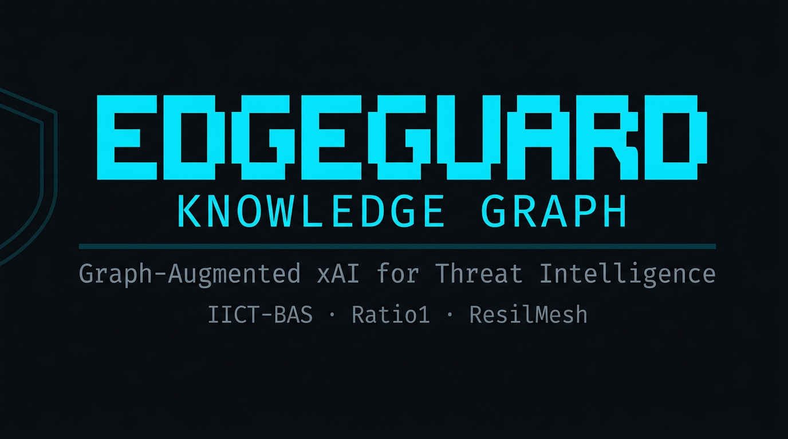

<p align="center">
  <!-- Replace the src below with your actual EdgeGuard logo URL once available -->
  
</p>

<h1 align="center">EdgeGuard</h1>

<p align="center">
  <strong>Graph-Augmented xAI for Threat Intelligence on Edge Infrastructure</strong>
</p>

<p align="center">
  <a href="https://github.com/Kopanov/EdgeGuard-Knowledge-Graph/actions/workflows/ci.yml"></a>
  
  
  
  
</p>

<p align="center">
  IICT-BAS + Ratio1 | financed by ResilMesh - open call 2
</p>

<p align="center">
  <em>This project has received funding through the <strong>ResilMesh Open Call 2</strong>,<br>
  supported by the European Union's Horizon Europe research and innovation programme.</em>
</p>

---

## 🤔 What is EdgeGuard?

As part of the EdgeGuard framework for Graph-Augmented xAI on edge infrastructure, **EdgeGuard-Knowledge-Graph** is the first module. It is responsible for collecting, linking, and enriching threat intelligence by merging data from 11+ collectors into MISP as the single source of truth, then linking the most important data from **Energy, Healthcare, and Finance** sectors, enriched with global intelligence, into a Neo4j knowledge graph. The architecture goes both ways: Neo4j is the linked intelligence layer for fast graph queries and cross-source correlation, while MISP holds the ground truth with full provenance, raw data, and audit trails. Every node in Neo4j traces back to its MISP source events, so analysts can always verify the raw evidence behind any graph insight.

### What it does

1. **Collects** threat intelligence from multiple external feeds (11 active collector types + 2 sector placeholders — see `docs/DATA_SOURCES.md`)
2. **Stages** everything in MISP — the single source of truth — with full provenance and timestamps
3. **Builds** a Neo4j knowledge graph that shows relationships between threats, actors, and sectors
4. **Enriches** the graph automatically: decays stale IOC confidence, groups actors into campaigns, calibrates edge weights
5. **Filters** by sector (Healthcare, Energy, Finance) so you only see what matters for your industry
6. **Integrates** with ResilMesh/CRUSOE for network topology correlation

### The Workflow

```
External sources (11 active feeds + 2 sector placeholders)
       │
       ▼
  Collectors ──────────────────────────────────────────────────────────────────┐
  (OTX, NVD, CISA, MITRE, VirusTotal, AbuseIPDB,                                │
   ThreatFox, URLhaus, Feodo, SSL BL, CyberCure, …)                             │
       │                                                                        │
       ▼                                                                        │
  MISP  ◄────── Single Source of Truth ──────── all data lands here first      │
  (tagged: zone, source, TLP, confidence)                                       │
       │                                                                        │
       ▼                                                                        │
  STIX 2.1 conversion (primary) / direct fallback                               │
       │                                                                        │
       ▼                                                                        │
  Neo4j Knowledge Graph                                                         │
  (Indicators, CVEs, Actors, Techniques,                                        │
   Malware, Campaigns — all cross-linked)                                       │
       │                                                                        │
       ▼                                                                        │
  Enrichment Jobs (post-sync)                                                   │
  • IOC Confidence Decay (stale indicators retire automatically)               │
  • Campaign Node Builder (ThreatActor → Malware → IOC chains)                │
  • Co-occurrence Calibration (confidence weighted by event tightness)         │
       │                                                                        │
       ▼                                                                        │
  FastAPI REST API (port 8000) ────────────────────────────────────────────────┘
  GraphQL API (port 4001)       ← ISIM-compatible; ResilMesh queries EdgeGuard
  + NATS real-time alerts         the same way it queries ISIM
  + ResilMesh/CRUSOE integration
```

**Two operating modes:**
- **Baseline** (run once): Full historical load — up to 24 months per sector, unlimited items **per source** by default (`BASELINE_COLLECTION_LIMIT=0`), triggered manually
- **Incremental** (cron): 2-3 day window, **200** items per source by default (`EDGEGUARD_INCREMENTAL_LIMIT`), runs on schedule via Airflow

**Limits are stage-specific** (baseline per-source caps ≠ MISP→Neo4j fetch ≠ Neo4j RAM chunking). See **[docs/COLLECTION_AND_SYNC_LIMITS.md](docs/COLLECTION_AND_SYNC_LIMITS.md)** and **§ Collection & sync limits** later in this README.

---

## 🎯 Why EdgeGuard?

| Problem | EdgeGuard Solution |
|---------|-------------------|
| Too much threat data | Filters by sector (Healthcare / Energy / Finance / Global) |
| Hard to see connections | Graph database maps actors → techniques → CVEs → IOCs |
| Stale indicators cluttering your graph | IOC confidence decay retires old IOCs automatically |
| Can't tell which intel is trustworthy | Confidence calibrated by source count and event tightness |
| Multiple disconnected data sources | All feeds flow through MISP as single source of truth |
| Need to integrate with existing platform | Full ResilMesh/CRUSOE schema interoperability |

### Deterministic ingest & linking (not fuzzy graph matching)

EdgeGuard **intentionally** uses **deterministic identity and merge rules** (Neo4j **`MERGE`** on agreed keys, **exact** identifiers such as **CVE** and **MITRE `mitre_id`**, and scoped co-occurrence where documented) instead of **fuzzy** string/graph inference (e.g. substring **`CONTAINS`** for production entity linking). That trade-off favors **auditability**, **repeatable** syncs, and **fewer false-positive edges** in threat intel (wrong actor ↔ technique ↔ IOC links are high impact). Relationship logic for critical edges (e.g. **`USES`**) is spelled out in **[docs/ARCHITECTURE.md](docs/ARCHITECTURE.md)** and **[docs/KNOWLEDGE_GRAPH.md](docs/KNOWLEDGE_GRAPH.md)**; merge behavior, provenance, and the **exact-vs-fuzzy** history live in **[docs/DATA_QUALITY.md](docs/DATA_QUALITY.md)**.

---

## 🏢 Who is it for?

- **Hospitals** → Detects attacks on patient systems
- **Energy Companies** → Monitors grid security  
- **Banks** → Spots financial fraud
- **Any organization** with edge infrastructure

---

## 🚀 Quick Start

### Prerequisites

- Docker + Docker Compose (recommended — Neo4j, **`airflow_postgres`**, Airflow, REST API, GraphQL)
- **or** **Python 3.12+** (required for pip/venv installs; `pyproject.toml` / CI match this) + Neo4j + MISP. For **pip-installed Airflow** with PostgreSQL metadata, use **`pip install ".[airflow]"`** or **`apache-airflow[postgres]~=2.11`** (see `requirements.txt`). *Note: Airflow 2.11 supports Python 3.11+ upstream; EdgeGuard standardizes on 3.12+.*

### Option A — One-line install (Docker, recommended)

```bash
git clone https://github.com/Kopanov/EdgeGuard-Knowledge-Graph.git
cd EdgeGuard-Knowledge-Graph
./install.sh          # detects Docker, copies .env, builds image, starts stack
```

`install.sh` handles everything: checks Docker, copies `.env.example → .env`, builds the image, and runs `docker compose up -d`. After it finishes, edit `.env` with your API keys and restart.

**Post-install validation (run this after any install method):**
```bash
python src/edgeguard.py preflight  # comprehensive readiness check (env vars, APIs, Neo4j, MISP, Airflow, disk)
python src/edgeguard.py doctor     # checks MISP, Neo4j, Airflow, NATS, schema, API keys, version compatibility
python src/edgeguard.py stats      # quick dashboard: node counts, last sync, pipeline runs
```

`preflight` runs 7 check categories (env vars, API connectivity, Neo4j schema, MISP health, Airflow, disk, circuit breakers) and exits 0 = ready or 1 = issues found. `stats` shows what data is in the system right now.

**EdgeGuard CLI quick reference:**

| Command | Purpose |
|---------|---------|
| `edgeguard preflight` | Pre-run readiness check (7 categories, `--strict` for CI) |
| `edgeguard stats` | Quick dashboard: node counts, last sync, pipeline runs |
| `edgeguard stats --full` | + breakdown by zone, source, and MISP events/zones |
| `edgeguard stats --by-zone` | Node counts per zone (shows multi-zone overlap) |
| `edgeguard stats --by-source` | Node counts per source (nvd, otx, cisa, etc.) |
| `edgeguard stats --misp` | MISP event/attribute counts by source and by zone |
| `edgeguard dag status` | Airflow DAG run states (color-coded, `--state running` filter) |
| `edgeguard dag kill` | Force-fail stuck DAG runs (preserves checkpoints, `--dry-run`) |
| `edgeguard checkpoint status` | Per-source baseline progress + incremental cursors |
| `edgeguard checkpoint clear` | Clear baseline state (preserves incremental by default) |
| `edgeguard clear neo4j` | Delete all graph data from Neo4j (keeps constraints) |
| `edgeguard clear misp` | Delete all EdgeGuard events from MISP |
| `edgeguard clear all` | Full reset: Neo4j + MISP + checkpoints (`--force` skips confirmation) |
| `edgeguard doctor` | Diagnose connectivity (MISP, Neo4j, Airflow, NATS, schema) |
| `edgeguard heal` | Auto-repair (reset circuit breakers, clear locks, retry) |
| `edgeguard validate` | Config validation (rate limits, passwords, Neo4j schema) |
| `edgeguard monitor` | Real-time health display |
| `edgeguard version` | CalVer + git SHA |

All commands support `--help`. Data commands support `--json` for automation.

**Then (recommended order):** [docs/SETUP_GUIDE.md](docs/SETUP_GUIDE.md) (finish wiring) → [docs/AIRFLOW_DAGS.md](docs/AIRFLOW_DAGS.md) (run DAGs) → [docs/BASELINE_SMOKE_TEST.md](docs/BASELINE_SMOKE_TEST.md) (first baseline). See **§ Recommended reading order** below.

Or use `make` if you prefer explicit steps:

```bash
make install          # same as ./install.sh
make update           # git pull (ff-only) + auto: Docker Compose or pip path (see install.sh --help)
make start            # docker compose up -d (if already installed)
make stop             # docker compose down
make logs             # tail all service logs
make monitoring       # add Prometheus + Grafana
make help             # list all available targets
```

Services started (`docker compose up -d`):
```
Neo4j Browser        →  http://localhost:7474
Airflow UI           →  http://localhost:8082   (8082 avoids ResilMesh Temporal conflict)
REST API             →  http://localhost:8000/health
GraphQL API          →  http://localhost:4001/graphql
Graph Explorer       →  open docs/visualization.html in browser, connect to http://localhost:8000
airflow_postgres     →  PostgreSQL for Airflow metadata (Docker network only, not exposed)
```

Optional monitoring stack (`make monitoring` or `docker compose -f docker-compose.monitoring.yml up -d`):
```
Prometheus           →  http://localhost:9090
Grafana              →  http://localhost:3000   (set GRAFANA_ADMIN_PASSWORD in .env)
AlertManager         →  http://localhost:9093
Metrics endpoint     →  http://localhost:8001/metrics   (EdgeGuard pipeline metrics)
```
Airflow’s scheduler/UI state uses **`airflow_postgres`**; override credentials with **`AIRFLOW_POSTGRES_*`** in `.env` if needed. The **`airflow`** service image is **built** from **`Dockerfile.airflow`** (EdgeGuard Python deps such as **neo4j** / **pymisp**); run **`docker compose build airflow`** after dependency or **`src/`** logic changes. **`docker-compose.yml`** `x-common-env` forwards MISP→Neo4j tuning from `.env` (**`EDGEGUARD_NEO4J_SYNC_CHUNK_SIZE`**, **`EDGEGUARD_REL_BATCH_SIZE`**, **`EDGEGUARD_DEBUG_GC`**, **`EDGEGUARD_MISP_EVENT_SEARCH`**, etc.) into **airflow** / **api** / **graphql**. Ops and troubleshooting: [`docs/AIRFLOW_DAGS.md`](docs/AIRFLOW_DAGS.md).

### Option B — Python / pip (no Docker)

```bash
git clone https://github.com/Kopanov/EdgeGuard-Knowledge-Graph.git
cd EdgeGuard-Knowledge-Graph
./install.sh --python           # creates .venv, pip installs all extras
# or equivalently:
make install-py                 # same thing via Makefile
# or manually:
pip install ".[api,graphql,monitoring]"

cp .env.example .env            # fill in MISP_URL, MISP_API_KEY, NEO4J_PASSWORD
python src/health_check.py      # verify connectivity
```

For development (adds ruff, mypy, pytest):
```bash
./install.sh --python --dev
# or:
make install-dev
make ci                         # lint + type-check + tests in one command
```

**Already cloned?** Pull latest and refresh (auto-picks **Docker Compose** when `docker` + compose v2 + `docker-compose.yml` are available; otherwise **pip / .venv**):

```bash
./install.sh --update                    # auto (Docker or pip)
./install.sh --update --docker           # force Docker only (fail if unavailable)
./install.sh --update --python           # force pip / .venv
./install.sh --update --python --dev     # include dev extras
```

### Option C — Conda environment

```bash
conda create -n edgeguard python=3.12
conda activate edgeguard
git clone https://github.com/Kopanov/EdgeGuard-Knowledge-Graph.git
cd EdgeGuard-Knowledge-Graph
pip install ".[api,graphql,monitoring]"

cp .env.example .env            # fill in MISP_URL, MISP_API_KEY, NEO4J_PASSWORD
python src/edgeguard.py doctor  # validate setup
```

This requires **MISP and Neo4j running externally** (either as system services, Docker containers, or remote instances). Point to them via `MISP_URL` and `NEO4J_URI` in `.env`. See [`docs/ENVIRONMENTS.md`](docs/ENVIRONMENTS.md) for full conda/venv/edge setup details.

> **Multi-environment support:** EdgeGuard is designed to run in Docker (recommended), venv, conda, bare metal, or edge devices. The core pipeline (`src/`) has no Docker dependency — it uses standard Python, `requests` for MISP, `neo4j` driver for the graph database, and environment variables for all configuration. Docker Compose is a convenience layer for orchestrating Neo4j + Airflow + APIs together. If you run MISP and Neo4j externally (managed service, bare-metal install, or separate containers), just set `MISP_URL` and `NEO4J_URI` in `.env` and EdgeGuard works the same way.

Longer-form ops notes (CLI table, paths): [`docs/SETUP_GUIDE.md`](docs/SETUP_GUIDE.md).

### Auto-activate environment with direnv (recommended for daily dev)

[direnv](https://direnv.net) makes the `.venv` and `.env` activate automatically whenever you `cd` into the project — and deactivate when you leave. No manual `source .venv/bin/activate` needed.

```bash
# One-time setup (do this once on your machine)
brew install direnv              # macOS; or: apt install direnv
echo 'eval "$(direnv hook zsh)"' >> ~/.zshrc   # or bash / fish
source ~/.zshrc

# Inside the project — allow direnv once
cd EdgeGuard-Knowledge-Graph
direnv allow

# From now on: cd in → venv + .env auto-load. cd out → deactivate.
```

After `direnv allow`, `python` points to `.venv/bin/python`, all `.env` variables are exported, and `src/` is on `PYTHONPATH` — no manual steps needed on any subsequent terminal session.

### Airflow DAG-based workflow (recommended for production)

EdgeGuard ships **6** primary DAGs in `dags/edgeguard_pipeline.py` (baseline + five incremental/sync schedules). Optional **metrics** DAGs live in `dags/edgeguard_metrics_server.py` (`edgeguard_metrics_server`, `edgeguard_metrics_server_scheduled`). Once deployed:

```bash
# 1. Start the stack (includes Airflow + airflow_postgres)
docker compose up -d
#    Then open the Airflow UI (see “Services started” above). Pip-only Airflow: pip install ".[airflow]"
#    (installs apache-airflow[postgres]) and set AIRFLOW__DATABASE__SQL_ALCHEMY_CONN per Airflow DB docs.

# 2. Trigger the baseline DAG once (full historical load)
#    Airflow UI → DAGs → edgeguard_baseline → Trigger ▶
#    Optionally configure these Airflow Variables first:
#      BASELINE_DAYS = 730          (2 years of history)
#      BASELINE_COLLECTION_LIMIT = 0  (0 = unlimited)
#    Quick 7-day smoke test: set EDGEGUARD_BASELINE_DAYS=7 and
#      EDGEGUARD_BASELINE_COLLECTION_LIMIT=1000 in .env, restart airflow, then trigger.
#      See docs/BASELINE_SMOKE_TEST.md

# 3. Incremental cron DAGs start automatically after baseline:
#    edgeguard_pipeline    → every 30 min  (OTX)
#    edgeguard_medium_freq → every 4 hours (CISA, VirusTotal)
#    edgeguard_low_freq    → every 8 hours (NVD)
#    edgeguard_daily       → daily 2 AM    (MITRE, AbuseIPDB, feeds)
#    edgeguard_neo4j_sync  → every 3 days  (MISP → Neo4j + enrichment)
```

### Manual / standalone commands

```bash
cd src

# Check system health
python health_check.py

# Run MISP → Neo4j sync (incremental — last 3 days)
python run_misp_to_neo4j.py

# Run full historical sync
python run_misp_to_neo4j.py --full

# Run post-sync enrichment jobs manually
python enrichment_jobs.py

# Rebuild cross-source graph relationships
python build_relationships.py

# Check system health via CLI
python edgeguard.py doctor

# Auto-fix common issues
python edgeguard.py heal

# Pull latest from git + reinstall (from clone root; same as ./install.sh --update)
edgeguard update              # auto: Docker Compose if available, else pip
edgeguard --update            # synonym for the above
edgeguard update --docker     # force Docker only
edgeguard update --python     # force pip / .venv
edgeguard version             # release CalVer + git short SHA (no .env)
```

Release numbering uses **calendar versions** (`YYYY.M.D` in `pyproject.toml`). See [`docs/VERSIONING.md`](docs/VERSIONING.md).

---

## 📊 Key Features

### 1. Multi-Zone Threat Detection
- **Healthcare** (24 months of data)
- **Energy** (24 months of data)
- **Finance** (24 months of data)
- **Global** (24 months of data)
- Items can have **multiple zones** (e.g., `['finance', 'healthcare']`)

### 2. MISP as Single Source of Truth

All collectors write exclusively to MISP first. Neo4j is populated only from MISP — never directly. This gives you:
- Full audit trail and provenance for every piece of intelligence
- Ability to replay, audit, or re-sync the graph from MISP at any time
- A clean separation between raw collection and graph enrichment

### 3. Post-Sync Enrichment Pipeline

After every MISP → Neo4j sync, **four** enrichment jobs run automatically (`enrichment_jobs.run_all_enrichment_jobs`):

| Job | What it does |
|-----|-------------|
| **IOC Confidence Decay** | Tiered decay on stale indicators/vulnerabilities; retires when last update is **> 365 days** (`decay_ioc_confidence`) |
| **Campaign Node Builder** | Creates `Campaign` nodes from ThreatActor → Malware → Indicator chains (`build_campaign_nodes`) |
| **Co-occurrence Calibration** | Adjusts `INDICATES`/`EXPLOITS` edges with `source_id` in `misp_cooccurrence` / `misp_correlation` by MISP event size (`calibrate_cooccurrence_confidence`) |
| **Vulnerability↔CVE bridge** | Idempotent `REFERS_TO` between `Vulnerability` and `CVE` (`bridge_vulnerability_cve`) |

### 4. ResilMesh Interoperability

EdgeGuard mirrors the ResilMesh/CRUSOE data model — `CVE`, `CVSSv2/v31/v40`, `Vulnerability`, `Host`, `SoftwareVersion`, `ThreatActor`, `Technique`, `Campaign` nodes all match the upstream schema. All EdgeGuard-managed nodes carry an `edgeguard_managed = true` property for clean filtering in the shared graph. See [`docs/RESILMESH_INTEROPERABILITY.md`](docs/RESILMESH_INTEROPERABILITY.md) for full alignment details and work-in-progress items.

### 5. GraphQL API (ISIM-compatible, port 4001)

EdgeGuard exposes a Strawberry/FastAPI GraphQL endpoint on **port 4001** — the same port ISIM uses in ResilMesh deployments. This means ResilMesh can query EdgeGuard data the same way it queries ISIM, with no special integration work.

```graphql
# Example: critical vulnerabilities in healthcare sector
query {
  vulnerabilities(filter: { zone: "healthcare", minCvss: 9.0 }) {
    cveId description status severity
  }
}

# Example: active indicators with full CVE chain
query {
  indicators(filter: { zone: "energy", activeOnly: true }) {
    value indicatorType confidenceScore
  }
  cve(cveId: "CVE-2024-12345") {
    cvssV31 { baseScore attackVector }
  }
}
```

All node types are available: `CVE`, `Vulnerability`, `Indicator`, `ThreatActor`, `Malware`, `Technique`, `Tactic`, `Campaign`. See [`docs/ARCHITECTURE.md`](docs/ARCHITECTURE.md) for the full type coverage table.

### 6. Data sources (13 slots — see `docs/DATA_SOURCES.md`)

| Source | Type | What it provides |
|--------|------|------------------|
| **AlienVault OTX** | Threat Intelligence | Real-time indicator pulses, malware hashes, IPs, domains |
| **CISA KEV** | Vulnerabilities | Known exploited vulnerabilities catalog (US government) |
| **MITRE ATT&CK** | Tactics & Techniques | Enterprise attack matrices, threat actor profiles |
| **NVD** | Vulnerabilities | CVE database, severity scores (CVSS) |
| **MISP** | Threat Sharing | Hub — all collectors land here first (your deployment) |
| **VirusTotal** | Malware Analysis | File/hash reputation, scan results (70+ AV engines); primary collector `vt_collector.py`, enrichment path `virustotal_collector.py` |
| **AbuseIPDB** | Threat Intel | IP reputation and abuse reports |
| **Feodo Tracker** | Threat Intel | Banking trojan C&C server IPs |
| **SSL Blacklist** | Threat Intel | Malicious SSL certificate fingerprints |
| **URLhaus** | Threat Intel | Malicious URL database |
| **CyberCure** | Threat Intel | IP, URL, and hash feeds |
| **ThreatFox** | Threat Intel | IOCs with malware family context |
| **Energy / Healthcare feeds** | Threat Intel | Placeholder collectors (require ISAC / membership; not active by default) |

**What each means for you:**
- *CISA KEV* = "these are the most dangerous vulnerabilities hackers actually use"
- *MITRE ATT&CK* = "these are the techniques hackers use to attack"
- *VirusTotal* = "we scanned this file with 70+ tools and here's what they found"
- *AbuseIPDB* = "this IP has been reported for bad behavior"

**Data Retention by Sector:**
- Healthcare: 24 months
- Energy: 24 months
- Finance: 24 months
- Global: 24 months

### 7. Graph Knowledge Base
- Nodes: `Indicator`, `CVE`, `Vulnerability`, `Malware`, `ThreatActor`, `Technique`, `Tactic`, `Campaign`
- Relationships: `INDICATES`, `EXPLOITS`, `USES`, `USES_TECHNIQUE`, `ATTRIBUTED_TO`, `TARGETS`, `AFFECTS`, `IN_TACTIC`, `REFERS_TO`, `PART_OF`, `RUNS`, `HAS_CVSS_*`
- All edges carry `confidence_score`, `sources[]`, `imported_at`, `match_type`
- See [docs/KNOWLEDGE_GRAPH.md](docs/KNOWLEDGE_GRAPH.md) for full relationship schema with confidence scores.

### 8. Real-Time Alerts
- NATS integration for instant notifications
- Zone-based topic routing (`resilmesh.threats.zone.healthcare.*`)
- Multi-zone threat detection

### 9. Production-Ready CLI
- `doctor` — Diagnose connectivity and config issues
- `heal` — Auto-repair common problems
- `validate` — Check configuration
- `monitor` — Health status dashboard

### 10. Interactive Graph Explorer

EdgeGuard ships with a browser-based graph visualization built on **Cytoscape.js**. It connects to the FastAPI backend (`GET /graph/explore`) and renders live data from Neo4j — no additional software required.

> **Note on Neo4j Bloom:** Bloom is a powerful graph visualization tool, but it requires a Neo4j **Enterprise** license. To ensure wider accessibility and alignment with the Community Edition used by default, EdgeGuard provides its own open-source graph explorer as the primary visualization layer. If your deployment uses Neo4j Enterprise, Bloom can be used alongside or instead of the built-in explorer.

| View | What it shows |
|------|---------------|
| **Malware** | Malware families → Indicators → Sectors (hierarchical) |
| **Actors** | Threat actors → ATT&CK techniques → Tactics |
| **Indicators** | IOCs grouped and colored by zone |
| **CVEs** | Vulnerabilities sized by CVSS; CISA KEV entries highlighted in red |

**How to use:** open `docs/visualization.html` in a browser, enter the API URL (`http://localhost:8000`) and your API key, then click Connect. See [`docs/GRAPH_EXPLORER.md`](docs/GRAPH_EXPLORER.md) for full documentation.

---

## 📁 Project Structure

```
EdgeGuard/
├── src/
│   ├── config.py               # Zone keywords, sector limits, get_effective_limit()
│   ├── neo4j_client.py         # Graph MERGE logic, CVSS sub-nodes, relationship methods
│   ├── run_misp_to_neo4j.py    # MISP → Neo4j (attribute parse; Airflow path). Optional STIX for CLI/export
│   ├── run_pipeline.py         # CLI: run collectors → MISP; optional direct Neo4j path
│   ├── build_relationships.py  # Graph edges: exact / MITRE-ID (USES actor+malware→technique), co-occurrence INDICATES, …
│   ├── enrichment_jobs.py      # IOC decay, Campaign nodes, Vulnerability-CVE bridge
│   ├── query_api.py            # FastAPI REST API — sector-filtered queries (port 8000)
│   ├── graphql_api.py          # GraphQL API — ISIM-compatible endpoint (port 4001)
│   ├── graphql_schema.py       # Strawberry type definitions (CVE, Indicator, Actor …)
│   ├── health_check.py         # MISP + Neo4j connectivity checks
│   ├── resilience.py           # Circuit breakers and retry logic
│   ├── edgeguard.py            # CLI: preflight / stats / dag / checkpoint / doctor / heal / validate / monitor
│   ├── airflow_client.py       # Airflow REST API wrapper (used by CLI dag commands)
│   └── collectors/             # One module per data source
│       ├── otx_collector.py
│       ├── nvd_collector.py    # Extracts CVSSv2, CVSSv31, CVSSv40
│       ├── cisa_collector.py
│       ├── mitre_collector.py
│       ├── vt_collector.py
│       ├── abuseipdb_collector.py
│       ├── global_feed_collector.py   # ThreatFox, URLhaus, CyberCure
│       ├── finance_feed_collector.py  # Feodo, SSL Blacklist
│       └── misp_writer.py
├── dags/
│   ├── edgeguard_pipeline.py       # 6 DAGs: baseline, high/med/low/daily collectors, Neo4j sync
│   └── edgeguard_metrics_server.py # Optional Prometheus metrics DAG(s)
├── tests/                      # Pytest test suite (35 tests, CI-gated at 30% coverage)
├── docs/                       # Full documentation set (architecture, collectors, Airflow, …)
├── docker-compose.yml          # Full stack: Neo4j + airflow_postgres + Airflow + REST + GraphQL
├── docker-compose.monitoring.yml  # Prometheus + Grafana overlay
├── install.sh                  # One-command installer (Docker path or --python pip path)
├── Makefile                    # Shortcuts: make install / update / start / test / lint / health
└── .env.example                # Annotated variable reference
```

---

## 📖 Recommended reading order (new operators)

Use this path **after** you clone the repo — it matches how the product is run (install → Airflow → first baseline):

| Order | Document | Purpose |
|-------|-----------|---------|
| **1** | **[docs/SETUP_GUIDE.md](docs/SETUP_GUIDE.md)** | **Start here** — full install (Docker Compose or venv), `.env`, MISP/Neo4j connectivity, health checks |
| **2** | **[docs/AIRFLOW_DAGS.md](docs/AIRFLOW_DAGS.md)** | Run and debug DAGs (CLI, restart after `.env`, troubleshooting) |
| **3** | **[docs/BASELINE_SMOKE_TEST.md](docs/BASELINE_SMOKE_TEST.md)** | First **`edgeguard_baseline`** safely (short window / limits) |

Then open **[docs/COLLECTION_AND_SYNC_LIMITS.md](docs/COLLECTION_AND_SYNC_LIMITS.md)** when numbers like **200** vs **500** confuse you, and **[docs/MISP_SOURCES.md](docs/MISP_SOURCES.md)** for MISP networking / sync discovery. If sync **succeeds in Neo4j** but the Airflow task is **red** or **zombie-killed**, read **[docs/HEARTBEAT.md](docs/HEARTBEAT.md)**.

**Full index + “what to skip”:** [docs/DOCUMENTATION_AUDIT.md](docs/DOCUMENTATION_AUDIT.md).

**Quick reference:** Ports → see **§ Services started** above. CLI → see **§ edgeguard CLI**. Limits → see [docs/COLLECTION_AND_SYNC_LIMITS.md](docs/COLLECTION_AND_SYNC_LIMITS.md). OOM/zombie → see [docs/HEARTBEAT.md](docs/HEARTBEAT.md).

This README stays the **short** entry (quick start, ports, env vars). Deep onboarding is **SETUP_GUIDE**.

---

## 📚 Documentation

### Getting Started
| Document | Description |
|----------|-------------|
| [docs/SETUP_GUIDE.md](docs/SETUP_GUIDE.md) | **Start here** — full install (Docker Compose, venv, or conda), `.env`, MISP/Neo4j connectivity |
| [docs/AIRFLOW_DAGS.md](docs/AIRFLOW_DAGS.md) | Run and debug Airflow DAGs — CLI, restart, troubleshooting |
| [docs/BASELINE_SMOKE_TEST.md](docs/BASELINE_SMOKE_TEST.md) | First baseline safely — short window, small limits |
| [docs/API_KEYS_SETUP.md](docs/API_KEYS_SETUP.md) | Step-by-step instructions for obtaining each API key |
| [docs/ENVIRONMENTS.md](docs/ENVIRONMENTS.md) | Environment flag (`EDGEGUARD_ENV`), Python 3.12+, conda/venv setup |
| [docs/DOCKER_SETUP_GUIDE.md](docs/DOCKER_SETUP_GUIDE.md) | High-RAM tuning, clean slate, workstation-specific setup |

### Reference
| Document | Description |
|----------|-------------|
| [docs/TECHNICAL_SPEC.md](docs/TECHNICAL_SPEC.md) | **Canonical schema** — complete node/relationship Cypher specs, property types, constraints |
| [docs/COLLECTORS.md](docs/COLLECTORS.md) | Per-collector behavior, zone detection, enrichment fields, example output |
| [docs/DATA_SOURCES.md](docs/DATA_SOURCES.md) | All 13 data sources — inventory, classification, volume |
| [docs/DATA_SOURCES_RATE_LIMITS.md](docs/DATA_SOURCES_RATE_LIMITS.md) | API rate limits, costs, vendor endpoint reference |
| [docs/COLLECTION_AND_SYNC_LIMITS.md](docs/COLLECTION_AND_SYNC_LIMITS.md) | Which limit applies when — baseline vs incremental vs sync vs chunking |
| [docs/NEO4J_SAMPLE_QUERIES.md](docs/NEO4J_SAMPLE_QUERIES.md) | Cypher query examples for Neo4j Browser |

### Architecture & Design
| Document | Description |
|----------|-------------|
| [docs/ARCHITECTURE.md](docs/ARCHITECTURE.md) | Pipeline data flow, zone detection, chunking strategy |
| [docs/ARCHITECTURE_DIAGRAMS.md](docs/ARCHITECTURE_DIAGRAMS.md) | **Visual diagrams** (Mermaid) — system overview, graph schema, pipeline flow, retry logic, OOM guards |
| [docs/KNOWLEDGE_GRAPH.md](docs/KNOWLEDGE_GRAPH.md) | Zone/sector architecture, multi-zone support, example queries |
| [docs/METHODOLOGY.md](docs/METHODOLOGY.md) | Sector classification algorithm — keywords, scoring, thresholds |
| [docs/DATA_QUALITY.md](docs/DATA_QUALITY.md) | Deterministic MERGE strategy, exact matching rules |

### Operations
| Document | Description |
|----------|-------------|
| [docs/HEARTBEAT.md](docs/HEARTBEAT.md) | Airflow zombie tasks, OOM/SIGKILL, heartbeat timeout |
| [docs/PROMETHEUS_SETUP.md](docs/PROMETHEUS_SETUP.md) | Prometheus + Grafana monitoring stack |
| [docs/MISP_SOURCES.md](docs/MISP_SOURCES.md) | MISP as single source of truth, event discovery, metadata prefixes |
| [docs/RESILIENCE_CONFIG.md](docs/RESILIENCE_CONFIG.md) | Circuit breakers, retry logic, timeout tuning |
| [docs/SECRETS_MANAGEMENT.md](docs/SECRETS_MANAGEMENT.md) | Credential handling, env vars, key rotation |

### ResilMesh Integration
| Document | Description |
|----------|-------------|
| [docs/RESILMESH_INTEROPERABILITY.md](docs/RESILMESH_INTEROPERABILITY.md) | Integration contract — what EdgeGuard produces, what ResilMesh consumes |
| [docs/RESILMESH_INTEGRATION_GUIDE.md](docs/RESILMESH_INTEGRATION_GUIDE.md) | NATS messaging, Neo4j bridging, alert enrichment flow |
| [docs/RESILMESH_INTEGRATION_TESTING.md](docs/RESILMESH_INTEGRATION_TESTING.md) | Integration verification and test procedures |

### Tooling & Visualization
| Document | Description |
|----------|-------------|
| [docs/GRAPH_EXPLORER.md](docs/GRAPH_EXPLORER.md) | Interactive Cytoscape.js graph explorer — views, API, extending |
| [docs/DEMO.md](docs/DEMO.md) | Mock ResilMesh / NATS demo scenarios |

### Project
| Document | Description |
|----------|-------------|
| [docs/CONTRIBUTING.md](docs/CONTRIBUTING.md) | PR checklist — lint, test, CI requirements |
| [docs/VERSIONING.md](docs/VERSIONING.md) | CalVer policy (`YYYY.M.D`) |
| [docs/PRODUCTION_READINESS.md](docs/PRODUCTION_READINESS.md) | Component status and go-live checklist |
| [docs/DEPLOYMENT_READINESS_CHECKLIST.md](docs/DEPLOYMENT_READINESS_CHECKLIST.md) | Ordered deployment gates (`make deploy-check`) |
| [docs/DOCUMENTATION_AUDIT.md](docs/DOCUMENTATION_AUDIT.md) | Doc ↔ code traceability tables |

---

## 🔒 Security

- API keys stored in environment variables (never hardcoded)
- All Cypher queries are **parameterised** — no string interpolation, injection-safe
- SSL/TLS: see **[SSL/TLS (MISP vs Neo4j)](#ssltls-misp-https-vs-neo4j-bolt)** below — `EDGEGUARD_SSL_VERIFY` controls **HTTPS** to MISP and collectors, **not** Neo4j Bolt trust
- Credentials gitignored; Docker image never bakes in secrets
- Prometheus metrics endpoint bound to **loopback only** (`127.0.0.1:8001`) by default
- Airflow on port 8082 — intentionally avoids ResilMesh Temporal (8080)
- Circuit breakers for all external service calls

---

## 📝 License

MIT License - See LICENSE file for details.

---

## 🤝 Contributing

1. Fork the repo  
2. Create a feature branch  
3. Run **`make lint`** and **`make test`** (or see CI) before opening a PR  
4. Submit a pull request — **[`docs/CONTRIBUTING.md`](docs/CONTRIBUTING.md)** has the full checklist (Ruff, Mypy, pytest, Docker build)

---

**EdgeGuard** — Sector-aware threat intelligence on edge infrastructure, built for ResilMesh interoperability.

---

## ⚖️ Collection & sync limits

Use this when **`200`** or **`500`** in docs/code look contradictory.

| Stage | Typical caps | Notes |
|-------|----------------|-------|
| **Baseline collectors** (Airflow `edgeguard_baseline`, `run_pipeline --baseline`) | **`BASELINE_COLLECTION_LIMIT`** / **`EDGEGUARD_BASELINE_COLLECTION_LIMIT`** — max **items per external source** (OTX, NVD, CISA, MITRE, feeds, …). **`0`** = unlimited. | Does **not** configure MISP→Neo4j sync. The baseline DAG does **not** run **`MISPCollector`**. |
| **Incremental collectors** (cron DAGs) | **`EDGEGUARD_INCREMENTAL_LIMIT`** (default **200**/source), optional **`EDGEGUARD_MAX_ENTRIES`** override | Per-source item cap each scheduled run |
| **MISP → Neo4j sync** (`run_misp_to_neo4j`) | **Event list:** **`GET /events/index`** (then **`/events`**) with pagination (**500** rows/page, up to **100** pages) + client filter (**`info`** substring from **`EDGEGUARD_MISP_EVENT_SEARCH`**, default **EdgeGuard**, or **`org.name` == EdgeGuard**). **Fallback:** PyMISP **`restSearch`** + **`limit: 1000`**. **Per event:** parse → dedupe → **cross-item edges** → node merges → relationship batches. **Neo4j RAM:** **`EDGEGUARD_NEO4J_SYNC_CHUNK_SIZE`** / **`EDGEGUARD_REL_BATCH_SIZE`**. | Index page size ≠ Neo4j merge chunk **500** — see [COLLECTION_AND_SYNC_LIMITS.md](docs/COLLECTION_AND_SYNC_LIMITS.md) |
| **`MISPCollector`** (optional / not in default baseline step 2) | **`/events`** index cap **`min(3×limit, 2000)`** or **2000**; **500** attrs/event | Uses incremental-style **`resolve_collection_limit(..., baseline=False)`** — **not** baseline Airflow Variable |

**Full detail:** [docs/COLLECTION_AND_SYNC_LIMITS.md](docs/COLLECTION_AND_SYNC_LIMITS.md).

---

## 📋 Environment Variables

| Variable | Description | Default |
|----------|-------------|---------|
| `MISP_URL` | MISP server URL | `https://localhost:8443` |
| `MISP_API_KEY` | MISP API authentication key | *(required)* |
| `EDGEGUARD_MISP_EVENT_SEARCH` | Substring matched against **`Event.info`** when filtering index results (and passed to **`restSearch`** fallback). Must align with titles (e.g. `EdgeGuard-…`) | `EdgeGuard` |
| `EDGEGUARD_MISP_HTTP_HOST` | Optional HTTP `Host` header when MISP vhost ≠ URL hostname | *(unset)* |
| `NEO4J_URI` | Neo4j connection URI (Compose **`x-common-env`** defaults to **`bolt://neo4j:7687`**; host scripts often use **`bolt://localhost:7687`**) | see **`.env.example`** |
| `NEO4J_USER` | Neo4j username | `neo4j` |
| `NEO4J_PASSWORD` | Neo4j password | *(required, no default)* |
| `NEO4J_DATABASE` | Neo4j database name | `neo4j` |
| `EDGEGUARD_SSL_VERIFY` | Verify TLS certificates for **HTTPS** (MISP API, collectors, MISP→Neo4j sync `requests` / PyMISP). Unset or missing defaults to **`true`**. If unset or empty, **`SSL_VERIFY`** is read as the same flag (`true`/`false`). **`SSL_CERT_VERIFY`** is **not** used — set **`EDGEGUARD_SSL_VERIFY`** instead. | `true` |
| `OTX_API_KEY` | AlienVault OTX API key | *(optional)* |
| `NVD_API_KEY` | NVD API key | *(optional)* |
| `VIRUSTOTAL_API_KEY` | VirusTotal API key | *(optional)* |
| `ABUSEIPDB_API_KEY` | AbuseIPDB API key (free tier: 1 000 req/day) | *(optional)* |
| `THREATFOX_API_KEY` | Abuse.ch ThreatFox API key ([auth.abuse.ch](https://auth.abuse.ch/)). Without it, **`collect_threatfox`** skips (HTTP 401 if the task is forced to call the API without a key). | *(optional)* |
| `EDGEGUARD_COLLECT_SOURCES` | Optional comma-separated allowlist of collectors (e.g. `otx,nvd,cisa,mitre`). Unset = all enabled (subject to optional-key skips). See [docs/AIRFLOW_DAGS.md](docs/AIRFLOW_DAGS.md). | *(unset)* |
| `EDGEGUARD_ZONE_DETECT_THRESHOLD` | Minimum weighted score in **`detect_zones_from_text`** before a sector counts (default **1.5**). Raise for stricter tagging. | `1.5` |
| `EDGEGUARD_ZONE_ITEM_THRESHOLD` | Minimum combined score in **`detect_zones_from_item`** (default **1.5**). | `1.5` |
| `EDGEGUARD_MISP_PREFETCH_EXISTING_ATTRS` | Before **`push_items`**, load existing **`type`+`value`** on the target MISP event and skip duplicates (reruns, overlapping incremental windows). | `true` |
| `EDGEGUARD_OTX_INCREMENTAL_LOOKBACK_DAYS` | First OTX incremental run (no checkpoint): **`modified_since`** = now minus this many days. | `3` |
| `EDGEGUARD_OTX_INCREMENTAL_OVERLAP_SEC` | Subtract from stored OTX cursor when querying **`modified_since`** (clock skew / missed edge pulses). | `300` |
| `EDGEGUARD_OTX_INCREMENTAL_MAX_PAGES` | Max OTX API pages per incremental run (each page then **2s** delay). | `25` |
| `EDGEGUARD_MITRE_CONDITIONAL_GET` | MITRE STIX bundle: send **`If-None-Match`** on scheduled runs; **HTTP 304** skips re-parse/re-push. Baseline always full download. | `true` |
| `EDGEGUARD_NEO4J_SYNC_CHUNK_SIZE` | **MISP→Neo4j sync** (`run_misp_to_neo4j`): max **parsed graph items** merged **per Python chunk** (limits Airflow worker **RAM** during Neo4j writes). **Not** the MISP **event index** page size (**500** per page in code) or **`restSearch` `limit: 1000`** fallback — see [COLLECTION_AND_SYNC_LIMITS.md](docs/COLLECTION_AND_SYNC_LIMITS.md). Default **`500`**. Lower (e.g. `250`) if **OOM** / **SIGKILL** after parse. **`0`** or **`all`** = **single pass** (high OOM risk). | `500` |
| `EDGEGUARD_REL_BATCH_SIZE` | Max **relationship definitions** per **`create_misp_relationships_batch`** UNWIND round-trip (embedded + cross-item edges). Lower if Neo4j **transaction timeouts** on huge events. | `500` |
| `EDGEGUARD_DEBUG_GC` | If set to a **truthy** value, run **`gc.collect()`** after each Neo4j **node** merge chunk (diagnostics only; can **increase** peak RSS on tight workers — leave unset in production unless profiling). | *(unset)* |
| `EDGEGUARD_INCREMENTAL_LIMIT` | Max items **per source** for regular cron runs. `0` = unlimited. | `200` |
| `EDGEGUARD_MAX_ENTRIES` | Hard global override — overrides `INCREMENTAL_LIMIT` when non-zero. Leave at `0` to use per-mode defaults. | `0` |
| `EDGEGUARD_ENABLE_METRICS` | Start Prometheus metrics server on port 8001 | `false` |
| `EDGEGUARD_METRICS_HOST` | Bind address for metrics endpoint | `127.0.0.1` |
| `EDGEGUARD_GRAPHQL_PORT` | Port for the GraphQL API | `4001` |
| `EDGEGUARD_GRAPHQL_PLAYGROUND` | Enable GraphiQL browser explorer | `false` (default), set `true` only in dev |
| `AIRFLOW__WEBSERVER__WEB_SERVER_PORT` | Airflow UI port — set to 8082 to avoid ResilMesh Temporal conflict | `8082` |
| `AIRFLOW_POSTGRES_USER` | **Docker Compose only** — PostgreSQL user for `airflow_postgres` (Airflow metadata) | `airflow` |
| `AIRFLOW_POSTGRES_PASSWORD` | **Docker Compose only** — password for that role (use a strong value in production) | `airflow` |
| `AIRFLOW_POSTGRES_DB` | **Docker Compose only** — database name | `airflow` |
| `AIRFLOW__DATABASE__SQL_ALCHEMY_CONN` | Bare-metal / custom Airflow: SQLAlchemy URI for metadata (PostgreSQL or MySQL). Compose sets this automatically. | *(Compose: set by `docker-compose.yml`)* |
| `EDGEGUARD_MISP_BATCH_THROTTLE_SEC` | Pause (seconds) between each batch of 500 attributes pushed to MISP. Prevents memory exhaustion on large events. | `5.0` |
| `EDGEGUARD_MISP_EVENT_FETCH_THROTTLE_SEC` | Pause (seconds) between fetching consecutive MISP events during sync. | `2.0` |
| `EDGEGUARD_MAX_EVENT_ATTRIBUTES` | MISP→Neo4j sync: events exceeding this attribute count are **deferred** to the end of the sync run (smaller events process first). Prevents large events from OOM-killing the worker before critical data lands. Set to `0` to disable. | `50000` |
| `EDGEGUARD_DEV_MODE` | Enable console trace output (dev only) | *(unset)* |

### Recommended Memory Settings (730-day baseline)

A full 730-day baseline processes ~99K CVEs + ~115K indicators + CVSS sub-nodes. These settings are tested on a 32 GB Mac Mini and Ratio1 infrastructure:

| Setting | Recommended | Where to set | Notes |
|---------|-------------|-------------|-------|
| **MISP PHP `memory_limit`** | `4096M` | MISP container PHP config | Large events (95K+ attributes) need 2–4 GB per request |
| **MISP `MaxRequestWorkers`** | `25` | `/etc/apache2/mods-enabled/mpm_prefork.conf` | Default 150 causes OOM — each worker can use 1–2 GB on large events |
| **MISP `MaxConnectionsPerChild`** | `500` | Same Apache config file | Recycles workers to free leaked memory |
| **`AIRFLOW_MEMORY_LIMIT`** | `12g` | `.env` or `docker-compose.yml` | MISP→Neo4j sync needs 8–12 GB for 100K+ attribute events |
| **`NEO4J_HEAP_MAX`** | `12g` | `.env` | Neo4j JVM heap — handles 245K+ nodes and relationship building |
| **`NEO4J_PAGECACHE`** | `8g` | `.env` | Graph data caching for fast queries |
| **`NEO4J_CONTAINER_MEMORY_LIMIT`** | `24g` | `.env` or `docker-compose.yml` | Must exceed heap + pagecache + OS overhead |

Run `python src/edgeguard.py doctor` to verify settings before triggering a baseline. Full tuning guide: [docs/DOCKER_SETUP_GUIDE.md](docs/DOCKER_SETUP_GUIDE.md).

**MISP→Neo4j memory:** If sync **dies during Neo4j writes** with exit **-9**, check **Docker cgroup** limits. Raise **`AIRFLOW_MEMORY_LIMIT`** in **`.env`** or reduce **`EDGEGUARD_NEO4J_SYNC_CHUNK_SIZE`** / **`EDGEGUARD_REL_BATCH_SIZE`**. See [docs/SETUP_GUIDE.md](docs/SETUP_GUIDE.md), [docs/HEARTBEAT.md](docs/HEARTBEAT.md), [docs/AIRFLOW_DAGS.md](docs/AIRFLOW_DAGS.md). Do **not** set **`0`** / **`all`** for chunk size unless you understand the OOM tradeoff.

**Baseline collection** is controlled by Airflow Variables (not env vars). These caps apply to **each external collector** in the baseline DAG (OTX, NVD, …) — **not** to the MISP→Neo4j sync’s MISP event search (see [COLLECTION_AND_SYNC_LIMITS.md](docs/COLLECTION_AND_SYNC_LIMITS.md)).

| Airflow Variable | Description | Default |
|-----------------|-------------|---------|
| `BASELINE_COLLECTION_LIMIT` | Items **per external source** for baseline run. `0` = unlimited. | `0` |
| `BASELINE_DAYS` | How many days of history to fetch (NVD, OTX). | `730` |
| `EDGEGUARD_BASELINE_DAYS` | *(optional)* Overrides `BASELINE_DAYS` in the baseline DAG when set (e.g. `7` for smoke test). | *(unset)* |
| `EDGEGUARD_BASELINE_COLLECTION_LIMIT` | *(optional)* Overrides `BASELINE_COLLECTION_LIMIT` in the baseline DAG when set. | *(unset)* |

### SSL/TLS: MISP (HTTPS) vs Neo4j (Bolt)

| Layer | What uses TLS | How to relax verification in dev |
|--------|----------------|-----------------------------------|
| **MISP & HTTP collectors** | `requests`, PyMISP, `MISPHealthCheck` | Set **`EDGEGUARD_SSL_VERIFY=false`** (e.g. internal MISP with self-signed cert). **Production: keep `true`** and install a proper CA or trust store. |
| **MISP → Neo4j sync** | Same **`EDGEGUARD_SSL_VERIFY`** for all MISP HTTP calls (`run_misp_to_neo4j.py` sets the sync session’s `verify` from this flag). | If sync tasks run under **Airflow**, set the variable on the **scheduler and workers** (same env as the task), not only on collector containers — otherwise Tier1 can pass while **`full_neo4j_sync`** fails MISP health check. |
| **Neo4j driver** | Bolt over **`NEO4J_URI`** — **separate** from `EDGEGUARD_SSL_VERIFY` | Use URI schemes: **`bolt://`** / **`neo4j://`** (typical local/LAN), **`bolt+s://`** / **`neo4j+s://`** (TLS + system CAs), **`bolt+ssc://`** / **`neo4j+ssc://`** (TLS, trust self-signed per driver semantics). Self-signed Neo4j is **not** fixed by turning off `EDGEGUARD_SSL_VERIFY`. |

More detail: **`docs/AIRFLOW_DAGS.md`** (troubleshooting), **`src/config.py`** (`SSL_VERIFY`).

### Example .env file

```bash
# MISP Configuration
export MISP_URL="https://misp.example.com:8443"
export MISP_API_KEY="your-misp-api-key-here"

# Neo4j Configuration
export NEO4J_URI="bolt://localhost:7687"
export NEO4J_USER="neo4j"
export NEO4J_PASSWORD="your-secure-password"

# Dev only: internal MISP with self-signed HTTPS (also set on Airflow workers for MISP→Neo4j sync)
# export EDGEGUARD_SSL_VERIFY=false

# Optional: External threat feeds
export OTX_API_KEY="your-otx-key"
export NVD_API_KEY="your-nvd-key"

# Docker Compose — optional overrides for Airflow metadata Postgres (defaults: airflow/airflow/airflow)
# AIRFLOW_POSTGRES_USER=airflow
# AIRFLOW_POSTGRES_PASSWORD=change-me-in-production
# AIRFLOW_POSTGRES_DB=airflow
```

---

## 🏥 Health Check

EdgeGuard provides a comprehensive health check module to monitor system status.

### Usage

```bash
# Run health check
python src/health_check.py
```

### Programmatic Usage

```python
from health_check import health_check, format_health_status

# Get health status
status = health_check()
print(status)
# {
#     'misp_healthy': True,
#     'neo4j_healthy': True,
#     'misp_details': {...},
#     'neo4j_details': {...},
#     'last_pipeline_run': '2024-01-15T10:30:00',
#     'node_counts': {...},
#     'timestamp': '2024-01-15T12:00:00',
#     'overall_healthy': True
# }

# Format as readable string
print(format_health_status(status))
```

### HTTP APIs (FastAPI)

| Service | URL | Behavior |
|---------|-----|----------|
| **REST** (`query_api`) | `GET /health` | Always **HTTP 200**. Body: `status` (`ok` / `degraded`), `neo4j_connected` (Neo4j **ping + APOC** via `Neo4jClient.health_check()`). |
| **GraphQL** (`graphql_api`) | `GET /health` | **HTTP 200** only when Neo4j is healthy (same check). **HTTP 503** if the driver is missing or `health_check()` fails (suitable for strict load-balancer / k8s probes). |

Other routes on the REST API use a fast **`Neo4jClient.is_connected()`** (driver present) guard before running queries.

### Health Check Output (`health_check.py`)

- **MISP Status**: Connection health and response time
- **Neo4j Status**: Connection health, version, and response time
- **Node Counts**: Current counts of all node types in the graph
- **Last Pipeline Run**: Timestamp of the last successful sync

---

## 📊 Metrics

The metrics module tracks pipeline execution statistics.

### Usage

```bash
# View metrics summary
python src/metrics.py
```

### Programmatic Usage

```python
from metrics import PipelineMetrics

# Initialize metrics
metrics = PipelineMetrics()

# Start tracking a run
metrics.start_run()

# ... run your pipeline ...

# Record completion
metrics.end_run(
    success=True,
    nodes_created=150,
    relationships_created=75,
    events_processed=10,
    indicators_synced=100,
    vulnerabilities_synced=50
)

# Get summary
summary = metrics.get_summary()
print(f"Success rate: {summary['success_rate_percent']}%")

# Get recent runs
recent = metrics.get_recent_runs(5)
```

### Tracked Metrics

| Metric | Description |
|--------|-------------|
| Total Runs | Total number of pipeline executions |
| Success/Failure Count | Breakdown of successful vs failed runs |
| Success Rate | Percentage of successful runs |
| Duration | Time taken for each run |
| Nodes Created | Number of nodes created per run |
| Relationships Created | Number of relationships created per run |
| Events Processed | MISP events processed per run |
| By Type | Indicators, vulnerabilities, malware, actors, techniques |

### Metrics Storage

Metrics are persisted to `data/metrics.json` for durability across restarts.

---

## 📈 Current Status

EdgeGuard v2026.4.4 is **production-test ready**. Full pipeline validated on Docker (Mac Mini), all CI green, BugBot clean.

### ✅ Implemented

- **11 active source collectors** with enriched fields (+ optional VirusTotal enrichment module, + sector feed placeholders): OTX, NVD (CVSSv2/v31/v40 + CISA KEV + version constraints), CISA, MITRE ATT&CK (Techniques + Actors + Malware + **Tools**), VirusTotal (YARA rules, Sigma rules, sandbox verdicts), AbuseIPDB (abuse categories), ThreatFox, URLhaus (url_status, reporter), CyberCure, Feodo (last_online), SSL Blacklist
- **MISP as Single Source of Truth**: All collectors write to MISP first with full provenance tagging; OTX_META/TF_META/NVD_META comment prefixes for metadata round-trip
- **Neo4j Knowledge Graph**: Production-ready graph with MERGE deduplication, 11 deterministic relationship types with single-key MERGE deduplication across sources
- **ResilMesh schema alignment**: `CVE`, `Vulnerability` (with `status: LIST`), `CVSSv2/v30/v31/v40` (bidirectional), `Tool`, `REFERS_TO` bridge, `edgeguard_managed` on all node types (including 13 ResilMesh asset-layer methods), IP.tag as LIST — all matching the official ResilMesh data model
- **STIX 2.1 Pipeline**: Primary conversion path with direct MISP fallback
- **Baseline + Incremental Modes**: One-time deep historical load and scheduled 2-3 day incremental updates; checkpoint file locking for concurrent Airflow workers
- **6 primary Airflow DAGs** in `edgeguard_pipeline.py` (+ optional metrics DAGs); UI on port **8082** (intentional vs Temporal); sync conflict guard between baseline and incremental
- **Post-Sync Enrichment**: IOC confidence decay, Campaign node materialisation (with cleanup for retired indicators), Vulnerability↔CVE bridge, co-occurrence confidence calibration
- **Multi-Zone Sector Filtering**: Healthcare, Energy, Finance, Global — 147 weighted keywords with negative exclusions, zone validation whitelist in Sector node creation
- **GraphQL API** (port 4001): Strawberry/FastAPI with CORS; all node types queryable including Tool; 14 enrichment fields resolved; GraphiQL opt-in via `EDGEGUARD_GRAPHQL_PLAYGROUND=true`
- **FastAPI REST API** (port 8000): Sector-filtered, rate-limited, authenticated endpoints; `/graph/explore` with 4 views (Malware, Actors, Indicators, CVEs)
- **Interactive Graph Explorer**: Browser-based Cytoscape.js visualization with live Neo4j data, CISA KEV highlighting, search, zone filtering ([docs/GRAPH_EXPLORER.md](docs/GRAPH_EXPLORER.md))
- **Full-stack Docker Compose**: Neo4j + Airflow + REST API + GraphQL in one `docker compose up -d`; also supports conda/venv/bare-metal with external MISP+Neo4j
- **CI/CD**: Lint (ruff), type-check (mypy), pytest (161 tests, 30% coverage gate), Docker build, pip-audit, BugBot — all green
- **Health Checks + Metrics**: MISP (with PyMISP version compatibility detection), Neo4j (with 30s timeout), Airflow, NATS; Prometheus/Grafana monitoring stack
- **Production CLI** (19 commands): `preflight` (7-category readiness check), `stats --full` (node counts by zone/source + MISP breakdown), `dag status/kill` (Airflow run monitoring + stuck-run recovery), `checkpoint status/clear` (baseline progress + incremental cursors), `clear neo4j/misp/all`, `source list/add/remove`, `doctor`, `heal`, `validate`, `monitor`, `setup`, `update`, `version`
- **Circuit Breakers + Retry**: Fixed HALF_OPEN deadlock, monotonic time, resilience patterns for all external service calls
- **UTC-aware timestamps**: All 70+ datetime instances across 24 files use `timezone.utc` (Python 3.12 compatible)

### 🚧 In Progress / Planned

- **SoftwareVersion bridge**: `(Vulnerability)-[:IN]->(SoftwareVersion)-[:ON]->(Host)` — NVD `version_constraints` are now collected and stored; CPE-to-SoftwareVersion mapping pending (see [`docs/RESILMESH_INTEROPERABILITY.md`](docs/RESILMESH_INTEROPERABILITY.md) §4.4)
- **ISIM GraphQL schema extension**: EdgeGuard types (Indicator, ThreatActor, Malware, Technique, Campaign, Tool) exposed via port 4001 — formal ISIM schema merge with ResilMesh team planned
- **Neo4j role separation**: Currently shared credentials; Neo4j Enterprise roles or GraphQL as the access layer are the target state
- **Real-time NATS alerting**: Demo implemented (`demo/mock_resilmesh_publisher.py`), production hardening in progress
- **Healthcare and Energy sector-specific feed collectors**: HC3, E-ISAC — requires ISAC membership; placeholder collectors ready

---

_Last updated: 2026-04-05_

