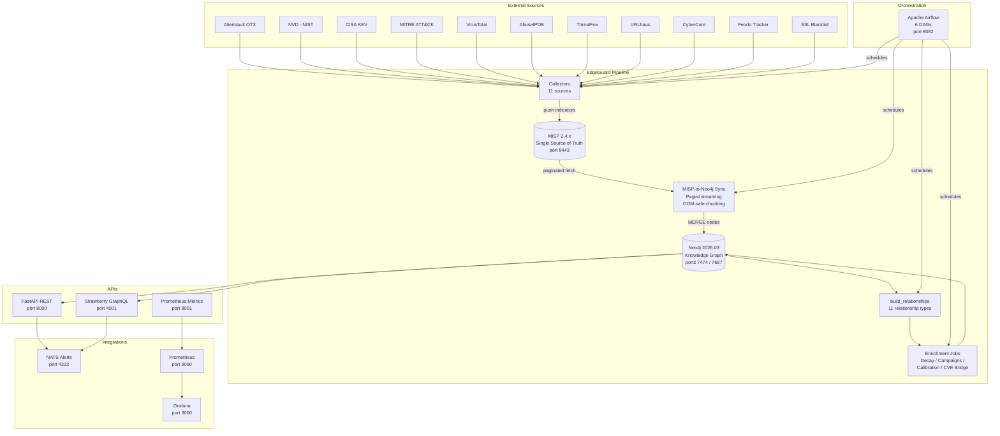
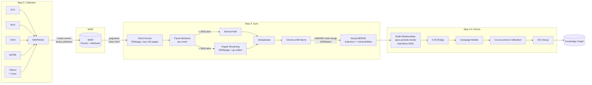
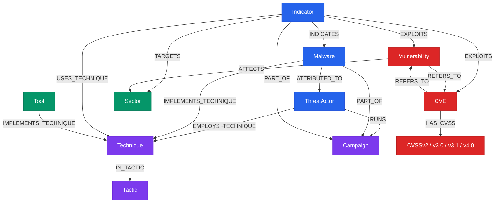
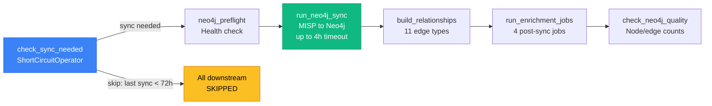
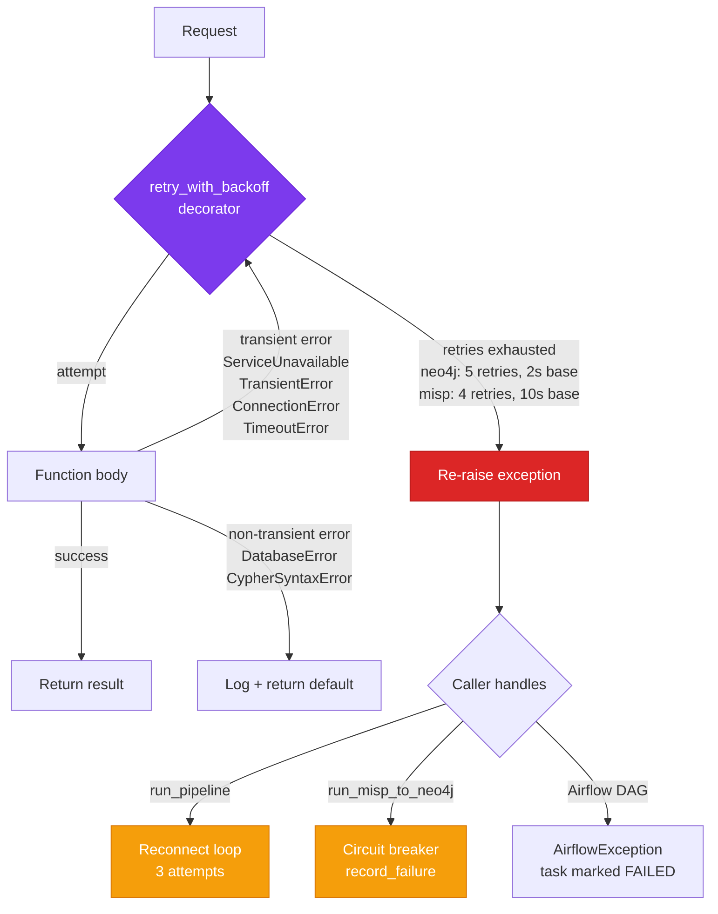
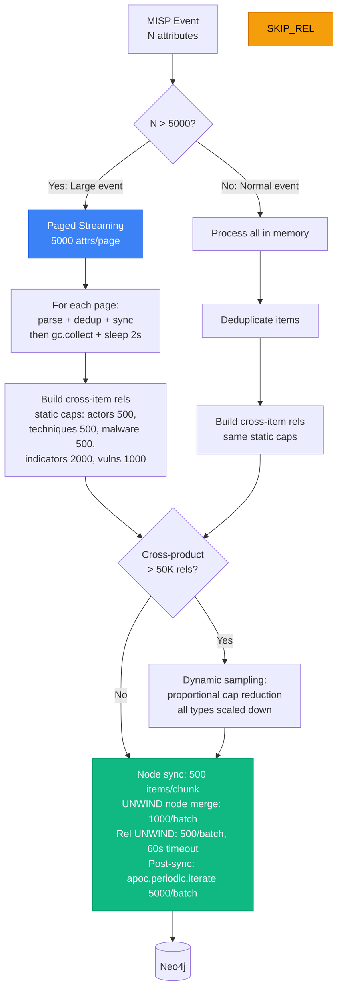
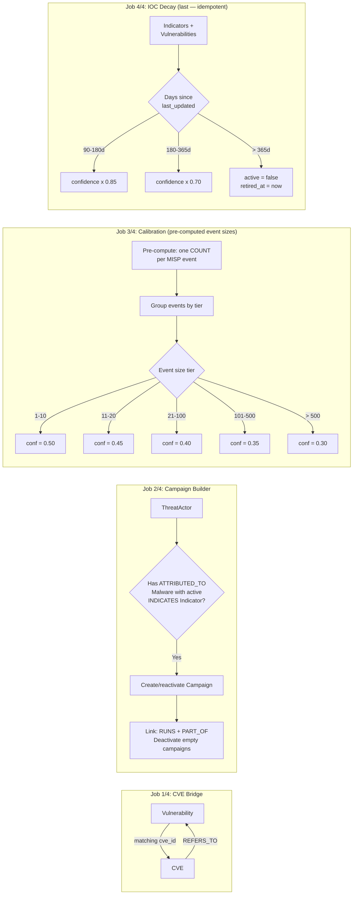

# EdgeGuard Knowledge Graph — Architecture Diagrams

> Graph-Augmented xAI for Threat Intelligence on Edge Infrastructure
> (IICT-BAS + Ratio1, funded by ResilMesh)

**Design philosophy:** Neo4j is the **linked intelligence layer** for fast graph queries and cross-source correlation. MISP holds the **ground truth** with full provenance, raw data, and audit trails. Every node in Neo4j traces back to its MISP source events via `misp_event_ids` and `SOURCED_FROM` relationships.

All diagrams are written in [Mermaid](https://mermaid.js.org/) and render natively on GitHub.
To export for papers: paste into [mermaid.live](https://mermaid.live) and download as PNG/SVG/PDF.

---

## 1. System Architecture Overview

---

## 2. Data Pipeline Flow

---

## 3. Knowledge Graph Schema

---

## 4. Airflow DAG Scheduling

```mermaid
gantt
    title EdgeGuard Airflow DAG Schedule (24h view)
    dateFormat HH:mm
    axisFormat %H:%M

    section High Frequency
    edgeguard_pipeline (OTX)        :active, 00:00, 00:05
    edgeguard_pipeline (OTX)        :active, 00:30, 00:35
    edgeguard_pipeline (OTX)        :active, 01:00, 01:05

    section Medium Frequency
    edgeguard_medium_freq (CISA+VT) :crit, 00:00, 00:15
    edgeguard_medium_freq (CISA+VT) :crit, 04:00, 04:15

    section Low Frequency
    edgeguard_low_freq (NVD)        :done, 00:00, 00:30
    edgeguard_low_freq (NVD)        :done, 08:00, 08:30

    section Daily
    edgeguard_daily (MITRE+6 more)  :02:00, 02:45

    section Neo4j Sync
    edgeguard_neo4j_sync            :03:00, 04:00
```

---

## 5. Neo4j Sync Task Chain

---

## 6. Retry and Resilience Architecture

---

## 7. OOM Protection Strategy

---

## 8. Enrichment Pipeline Detail

---

## Technology Stack

| Layer | Technology | Version |
|-------|-----------|---------|
| Graph Database | Neo4j Community | 2026.03 |
| Threat Intel Platform | MISP | 2.4.x |
| Orchestration | Apache Airflow | 3.2 |
| REST API | FastAPI + Uvicorn | latest |
| GraphQL API | Strawberry | latest |
| Messaging | NATS | latest |
| Monitoring | Prometheus + Grafana | latest |
| Data Format | STIX 2.1 | standard |
| Language | Python | 3.12+ |
| Versioning | CalVer | 2026.4.x |

---

*Last updated: 2026-04-06*
